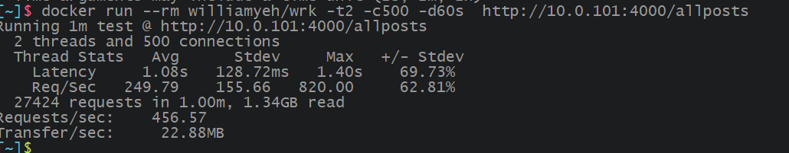

<!--
 * @Description: 说明文档
 * @Author: homobulla
 * @Date: 2019-08-13 12:02:24
 * @LastEditTime: 2019-10-18 10:36:12
 * @LastEditors: Please set LastEditors
 -->

## node+mysql+koa 搭建的博客

### 原文地址

[node+koa+mysql 博客](http://www.wclimb.site/2017/07/12/Node-Koa2-Mysql-%E6%90%AD%E5%BB%BA%E7%AE%80%E6%98%93%E5%8D%9A%E5%AE%A2/)

### 目录说明

-   config 存放默认文件-配置文件
-   lib 存放操作数据库文件
-   middlewares 存放判断登录与否文件-中间件
-   public 存放样式和头像文件-静态资源
-   routes 存放路由文件
-   views 存放模板文件-页面
-   index 程序主文件
-   package.json 包括项目名、作者、依赖 等等

### 依赖项作用说明

-   koa node 框架
-   koa-bodyparser 表单解析中间件
-   koa-mysql-session、koa-session-minimal 处理数据库的中间件
-   koa-router 路由中间件
-   koa-static 静态资源加载中间件
-   ejs 模板引擎
-   md5 密码加密
-   moment 时间中间件
-   mysql 数据库
-   markdown-it markdown 语法
-   koa-views 模板呈现中间件
-   chai mocha 测试使用
-   koa-static-cache 文件缓存- koa-bodyparser 表单解析中间件
-

## socket

目前加入了 socket ,但是所有的通信都是全体广播，需要有房间的概念，即需要改成单独通信。

### 更新

-   2019-08-15: 改为前后端分离
-   node 分层代码 [前后端分离之 NodeJS+mysql 分层之美](https://www.jianshu.com/p/dab01487a9df)

### node 分层说明

-   bin：启动 http/https 服务
-   commons：存放公共方法文件
-   config：存放配置文件
-   model：存放 dao 文件，负责和数据库交互
-   service：存放 service 文件，负责和 dao 交互
-   routers：存放 controller 文件，负责和 service 交互
-   app.js：项目入口文件
-   babelrc：babel 配置文件
-   package.json：包依赖管理文件

### 登录逻辑问题

cookie 以及 JWT
即首先生成一个 24 小时的`toekn`，然后将其扔到`cookie`里，放`cookie`里的考虑是登录状态的处理完全放在后端部分，前端就不用在请求头里做处理，同时也更方面的操作登录状态。

### 登录&安全相关

首先用 ip 和其他参数生成一个 `token`，然后设置一个签名的`cookie`来进行存放`token`，让前端接口请求自动携带`cookie`，不知道这样绕了一圈有没有什么问题。

账户密码部分使用了 `rsa`来进行加密处理。
[koa-helmet](https://juejin.im/post/5bd1e6136fb9a05d0a057316): 设置 Http 头保障应用程序安全

### 问题

1. 签名`cookie`发送的同时也把明文的传了过去。

### 压力测试

使用`wrk`进行压力测试，因为电脑系统`win10`,所以顺带尝试了一下`docker`的使用。
本地测试结果如下:（500 个 TCP 链接在 60 秒内的请求数量与延迟情况

可以使用`lua`脚本进行更复杂的测试
